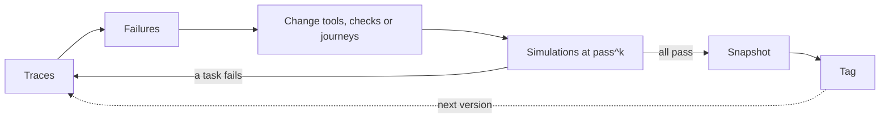

# How it was built

A build log for trust-layer-agent: how the work was organized, what happened in what order, which decisions were made and why, and what it cost. Versions are referred to by tag (`v1`, `v2`) and changes by commit message.

Built with Claude Code, with a second AI chat acting as project lead.

## What this is

trust-layer-agent is a small trust layer for customer-facing agents that act, not just answer. It rests on one rule: **the model chooses the words; code decides what's allowed.** Tools run only when checks in code allow them, a reply can't claim a price, date or "done" that no tool confirmed, the model sees only the customer data it needs, and a version ships only after it passes simulations. Everything else in this log follows from taking that rule seriously and then measuring whether it held.

## How the work was organized

Two sessions ran side by side:

- **A project-lead chat** decided scope, wrote each prompt, and reviewed what came back. It never edited code.
- **A coding agent in the terminal** did the work in a dedicated folder for the project, and later in a separate git worktree when docs and code were written at the same time.

The prompts followed a fixed set of rules:

- **One step per prompt, with a clear stop point.** The agent stops and shows its results; the next step starts only after review.
- **Proof, not claims.** Every step ends with evidence: test output, `git log`, line counts, cost.
- **A design paragraph before each piece:** the choice, the trade-off, and the production pattern it mirrors. Then the smallest version that works.
- **Commit at every green state**, and tag versions (`v1`, `v2`).
- **Keys only in `.env`, edited by hand.** The agent never reads or writes them.
- **A spend cap**, and **a cost estimate before every paid run.**
- **Never weaken a task to make it pass.** If a simulation fails, the runtime, tools, checks or journeys change, not the task.

## Timeline

All on 2026-10-02. Times are approximate.

- **~1pm, setup.** Repo, project brief, `.env`.
- **~1:30pm, the brief, three versions before any code.**
  - v1: Python, built inside an existing benchmark.
  - v2: model-agnostic, with its own fictional example domain and deterministic checks ("docs: brief v2").
  - v3: TypeScript ("docs: brief v3"). The first real integration target is a plain-JavaScript Express + Postgres app, and `test` must run in the user's own language. That ruled out a benchmark dependency, so the project got its own simulator.
- **Early afternoon, a private teardown** of the public benchmark credited in the README. It grades outcomes by comparing the final database state, which is the right idea. What the agent *says* is barely graded (a substring match). Its history shows many fixes to task answers. Its policies leave consent and similar rules to the prompt.
- **~4:40pm, API design reviewed before code** ("docs: approved API design v1"). Review made six changes:
  1. Bound fields are injected from the session, so the model never handles account ids.
  2. `verified_first` applies only when some tool can verify a customer.
  3. Numbers written by the operator (instructions, knowledge) count as confirmed.
  4. "Done" needs a successful write in this session.
  5. Journeys split enforced guardrails from prompt-only guidance.
  6. Personal-data fields are hidden from the model by default.
- **~5pm to ~8pm, built in five pieces**, each tested with a scripted fake model before any real call. Test counts are cumulative:

  | Piece | Commit | Tests |
  |---|---|---|
  | Tools and session | "feat: scaffold, tools and session" | 19 |
  | Checks | "feat: checks and built-ins" | 60 |
  | Agent loop, chat, traces (including the failure-story test) | "feat: agent loop, chat and traces" | 72 |
  | Journeys and model adapters | "feat: journeys", "feat: anthropic and openai-compatible adapters" | 92 |
  | The subscriptions example (tag `v1`) | "feat: subscriptions example and refunds quickstart" | 93 |

- **Bugs caught by review before they shipped:**
  - "Done" language passed after an *unrelated* successful write ("fix: block done language while a write has an unresolved failure").
  - Retry notes were placed in the customer's channel, where a customer could forge them. Fixed by fencing all untrusted text ("fix: fence untrusted text so trust-layer notes can't be forged").
  - Tool names were inferred from function names, which minifiers and refactors change. Names are now always explicit.
  - Comments were stripped to get under the line cap. Reverted; the cap now counts logic lines only.
- **~7pm, first real model call.** A 3-task smoke run on the benchmark ($0.37) passed, but it showed what passing doesn't check: consent enforced only by a prompt rule, a derived number no tool returned, full customer records sent to the model, and handoffs that weren't graded.
- **Evening, hands-on QA by the author** found the claims check matching bare numbers: "$10" counted as confirmed by a 10% discount.
- **~8:20pm, the simulator** ("feat: simulation engine and grader"). 8 tasks at k=1 ($0.44) all passed, which showed the tasks were too polite. The run also caught negated "done" language ("it hasn't been switched") being blocked.
- **~9:50pm, 18 tasks, including adversarial ones** ("feat: test and snapshot commands, adversarial tasks"). Two changes to the grader:
  - It got its own independent matcher for forbidden claims. A grader that shares the code under test inherits its bugs.
  - Over-blocking is reported as *friction*, not failure.
- **~10:15pm, v1 baseline** ("chore: v1 baseline snapshot"): pass^4 89%, $4.14. The two failing tasks were correct refusals whose replies still carried a forbidden number ("I can't do 50% off"). The task asserts a system guarantee (never state that number), so the runtime got fixed, not the grader.
- **~10:50pm, v2** ("chore: v2 snapshot", tag `v2`). Three fixes: claims matched by unit, dates from tool timestamps and the agent's clock, and negated "done" language plus requests to proceed after a shown quote no longer blocked. pass^4 100%, $4.12. Friction rose from 20 to 25, because stricter number guarding now blocks refusals that repeat the customer's number.
- **~11pm, docs.** Writing SPEC.md from the code, rather than from the design doc, found about 15 points where the two had drifted apart, and 9 bugs that 138 tests had missed.
- **Overnight, a model-size × checks experiment.** Results below.

## Overnight experiment: model size × checks

> **PLACEHOLDER: results not yet in.** Fill in after the run: the models tried, checks on vs off (`TRUST_LAYER_CHECKS=off` in the subscriptions example keeps every prompt but removes the built-in checks and journey guardrails), pass^4, friction and cost per cell, and what it says about which rules belong in code.

| Agent model | Checks | pass^4 | Friction | Cost |
|---|---|---|---|---|
| TODO | on | TODO | TODO | TODO |
| TODO | off | TODO | TODO | TODO |

## Decision log

**1. TypeScript over Python.**
Decision: write the reference implementation in TypeScript, published as plain ESM JavaScript with types.
Alternatives: Python, which most agent tooling and the benchmark use.
Why: the first integration is a plain-JavaScript Express + Postgres app, and a Python library can't be imported there. `test` has to run in the user's language. A Python port is first on the roadmap.
Evidence: "docs: brief v3"; the plain-JS route sketch in docs/design.md needed no core change.

**2. Own simulator over a benchmark dependency.**
Decision: a small built-in simulator (persona-driven customer, seeded in-memory data, deterministic grading).
Alternatives: run tasks inside an existing benchmark.
Why: users need to run `test` on their own tools and data, in their own language. The teardown also showed a gap worth closing: replies were barely graded.
Evidence: src/sim/ is about 230 lines; the benchmark's grading ideas are credited in the README.

**3. Fetch adapters, no SDKs.**
Decision: model adapters call provider HTTP APIs with `fetch`.
Alternatives: official provider SDKs, or an agent framework.
Why: runtime dependencies stay at zod and yaml, and any model can fill any role (agent, simulated customer). An SDK per provider would grow the install and the surface.
Evidence: src/models/ adapters are under 50 lines each; both were smoke-tested with real calls before `v1`.

**4. Deterministic checks first; LLM review on the roadmap.**
Decision: every built-in check is plain code. A small-model reply review stays optional and isn't built yet.
Alternatives: an LLM judge on every reply.
Why: safety guarantees shouldn't depend on model quality, and a check has to give the same answer every time to be testable.
Evidence: test/claims.test.ts and test/builtins.test.ts are plain input → allow/block tables.

**5. Bind injection.**
Decision: identity fields like `accountId` are filled from session facts and removed from the schema the model sees.
Alternatives: let the model pass ids and validate them afterwards.
Why: a model that never handles the id can't be talked into using someone else's.
Evidence: the "other-account" task passes 4/4 in both snapshots.

**6. Guardrails vs guidance.**
Decision: a journey has two parts. Guardrails compile to checks and are enforced; guidance goes into the prompt.
Alternatives: one block of rules, all in the prompt.
Why: the teardown and the smoke run both showed consent left to a prompt rule. Readers of a journey file should see which lines are guarantees.
Evidence: src/journeys.ts; the checks-off example mode keeps guidance and strips guardrails, for comparison.

**7. Claims matched by unit.**
Decision: a number in a reply is confirmed only by a tool value of the same kind (money, percent, plain number).
Alternatives: match bare numbers.
Why: "$10" was passing as confirmed by an unrelated 10% discount, and "50%" by a $50 savings.
Evidence: "fix: claims match values by kind"; part of the `v1` → `v2` change from 89% to 100%.

**8. Customer numbers never confirm a claim.**
Decision: only tools, operator text and the agent's clock confirm values. Whatever the customer typed doesn't.
Alternatives: treat numbers the customer said as confirmed, which avoids blocking refusals.
Why: otherwise a haggler confirms their own price ("so it's $10, right?").
Evidence: the lowball-price and authority-claim tasks. The cost is friction, see 9.

**9. Friction as a separate metric.**
Decision: blocked drafts and actions are counted and reported, but don't fail a task.
Alternatives: ignore blocks, or count them as failures.
Why: over-blocking is a real cost (slower, more retries) but not a broken guarantee. Hiding it would make stricter checks look free.
Evidence: friction rose 20 → 25 from `v1` to `v2`. lowball-price and authority-claim added 17 blocks, fewer false blocks on the two quote tasks took 11 away, and the other tasks netted 1 fewer.

**10. pass^4 on a pinned snapshot as the release gate.**
Decision: a version is good when every task passes in all 4 trials, compared against a snapshot that fingerprints the model, instructions, journeys, tools, checks, suite and library code.
Alternatives: average pass rate, or a single run.
Why: a customer agent that works 3 times out of 4 fails customers every day. A snapshot makes "better than last time" a like-for-like comparison.
Evidence: snapshots/v1.json and snapshots/v2.json; `test` warns when the configuration differs from the snapshot.

## The loop

Lived once, from `v1` to `v2`: the v1 traces showed two failing tasks and some over-blocking. The fixes went into the claims check, not the tasks, the 18 tasks ran again at k=4, and the result was pinned as snapshots/v2.json and tagged `v2`.

## What it cost

Paid model runs, in order:

| Run | Cost |
|---|---|
| Benchmark smoke run, 3 tasks, 1 trial | $0.37 |
| Adapter smoke test (`npm run smoke`), a few calls | ≈ $0.02 (estimated, not metered) |
| Simulator, 8 tasks × 1 trial | $0.44 |
| v1 baseline, 18 tasks × 4 trials | $4.14 |
| v2, 18 tasks × 4 trials | $4.12 |
| Hands-on chat and demo sessions | not metered, small |
| Overnight model-size × checks experiment | TODO |

Metered total before the overnight experiment: about **$9.10**. Every check, journey and agent-loop test runs on a scripted fake model and costs nothing.

## What I learned

### Rules in prompts vs checks in code

TODO: the author writes this in their own words.

### Reading the v1 → v2 diff

TODO: the author writes this in their own words.

### Why pass^k

TODO: the author writes this in their own words.

### Model size

TODO: the author writes this in their own words.

### What I'd do differently

TODO: the author writes this in their own words.
